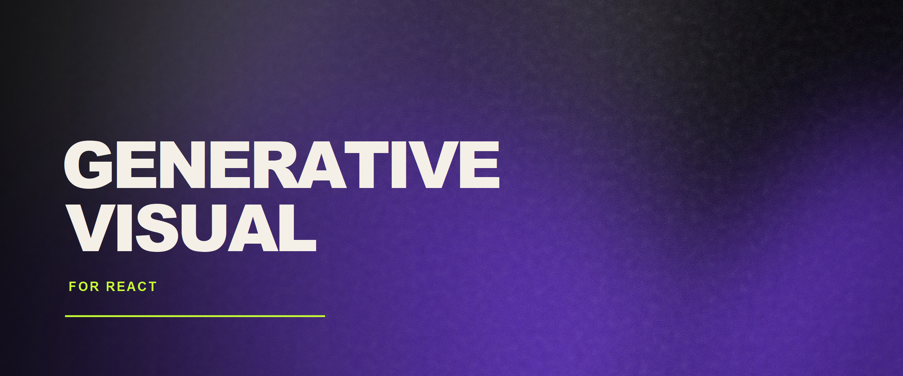

<p align="center">
  
</p>

<div align="center">

# React Generative Visual

Deterministic generative SVG visuals for React.

[](https://www.npmjs.com/package/@norbert-fila/react-generative-visual)
[](https://www.npmjs.com/package/@norbert-fila/react-generative-visual)
[](https://react.dev/)

</div>

React component for creating organic, layered SVG artwork from a seed, a color palette, and a few visual controls. The same input produces the same visual, so it works well for avatars, covers, hero backgrounds, cards, and user-specific artwork.

> [!TIP]
> Open the [Discovery playground](https://nubet.github.io/react-generative-visual/) to compare six seeded variations or explore randomized settings before writing any code.

## Features

- Deterministic output from a stable `seed`
- Native SVG with no Canvas, WebGL, or external assets
- Responsive sizing through `width`, `height`, `style`, and `className`
- Custom palettes with HEX color handling
- Core controls for complexity, contrast, distortion, softness, texture, and vignette
- Advanced controls for source count, separation, blur, source size, and grain
- Overlay content through `children`
- SSR-safe and compatible with React 18+
- No runtime dependencies beyond React

## Install

```bash
npm install @norbert-fila/react-generative-visual
```

## Quick Start

```tsx
import { GenerativeVisual } from "@norbert-fila/react-generative-visual";

export function Cover() {
  return (
    <GenerativeVisual
      seed="cover-01"
      colors={["#20113F", "#5D2BD9", "#0DB2D4", "#EF4B92"]}
      width="100%"
      height={320}
      style={{ borderRadius: 24 }}
    />
  );
}
```

The component does not impose a default visual size. Set `width` and `height` directly, or control the layout with CSS.

## Examples

### Hero background

```tsx
<GenerativeVisual
  seed="landing-hero"
  colors={["#16121F", "#6B35DB", "#0DB2D4", "#EF4B92"]}
  width="100%"
  height={480}
  vignette
/>
```

### Artwork with content

```tsx
<GenerativeVisual
  seed="night-bloom"
  colors={["#111015", "#5D2BD9", "#0DB2D4", "#EF4B92"]}
  width="100%"
  height={320}
  style={{ borderRadius: 20 }}
>
  <div style={{ padding: 24, color: "white" }}>
    <small>Artwork / 01</small>
    <h2>Night bloom</h2>
  </div>
</GenerativeVisual>
```

### Stable user-specific visuals

```tsx
<GenerativeVisual
  seed={`user:${user.id}`}
  colors={["#17151F", "#5D2BD9", "#0DB2D4"]}
  width={96}
  height={96}
  style={{ borderRadius: "50%" }}
/>
```

## API

### Required props

| Prop | Type | Description |
| --- | --- | --- |
| `seed` | `string` | Stable input for deterministic generation. |
| `colors` | `string[]` | HEX palette. The first color is used as the background. |

### Core controls

All numeric core controls use values from `0` to `1`.

| Prop | Default | Description |
| --- | ---: | --- |
| `complexity` | `0.25` | Controls the default number of generated sources. |
| `contrast` | `0.78` | Controls source opacity and visual strength. |
| `distortion` | `0.56` | Controls the displacement of each source. |
| `softness` | `0.64` | Controls the default source size and blur. |
| `texture` | `0.82` | Controls the default grain amount and size. |
| `vignette` | `false` | Adds a dark edge vignette. |

### Advanced controls

Advanced props override the related core mapping when provided.

| Prop | Range | Description |
| --- | ---: | --- |
| `sourceCount` | `3`-`10` | Number of generated sources. |
| `sourceSize` | `0.35`-`1.15` | Scale of each source. |
| `separation` | `0`-`1` | Minimum distance between source centers. |
| `blur` | `0.1`-`1` | SVG blur strength. |
| `grainAmount` | `0`-`1` | Opacity of the grain layers. |
| `grainSize` | `0`-`1` | Frequency of the grain layers. |

The component also accepts `width`, `height`, `className`, `style`, and `children`. Numeric generator values are clamped to safe ranges and invalid HEX colors are ignored.

## Determinism

The same `seed`, palette, and options produce the same visual:

```tsx
<GenerativeVisual seed="product-42" colors={["#F00", "#00F"]} />
```

This makes the component useful when visuals need to remain stable across renders, routes, sessions, or server and client output. Change the seed to generate a different composition without introducing runtime randomness.

## Next.js and SSR

The component is SSR-safe and does not require `"use client"` for basic rendering:

```tsx
import { GenerativeVisual } from "@norbert-fila/react-generative-visual";

export default function Page() {
  return (
    <GenerativeVisual
      seed="next-page"
      colors={["#F00", "#00F"]}
      width="100%"
      height={320}
    />
  );
}
```

## Playground and Docs

- [Playground](https://nubet.github.io/react-generative-visual/) - tune controls, compare seeds, copy React code, and download SVGs
- [Documentation](https://nubet.github.io/react-generative-visual/docs/) - installation, API reference, recipes, advanced controls, determinism, and FAQ
- [Advanced controls guide](./docs/advanced-controls.md) - visual comparisons for the low-level parameters

## Development

```bash
npm install
npm run dev
```

Run the checks and builds with:

```bash
npm run typecheck
npm run test
npm run build
npm run build:demo
```

The package build is written to `dist/`. The static playground and docs build is written to `dist-demo/` and can be hosted on GitHub Pages or any static host.

## Project Links

- [GitHub repository](https://github.com/Nubet/react-generative-visual)
- [npm package](https://www.npmjs.com/package/@norbert-fila/react-generative-visual)
- [Issues](https://github.com/Nubet/react-generative-visual/issues)
